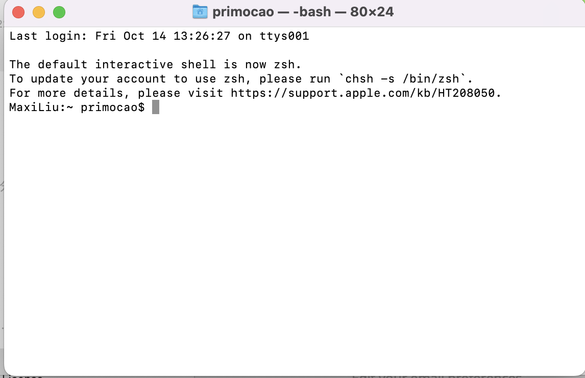

# ESE519-setup_guide
### Maxi Liu

### Terminal 
- For this lab, I just used the mac original terminal:

Using cd and ls:

### Text editor, vim
- basic operations
    To open the file by bim: `$vim filename.css`
    `i` to edit the file, `:wq` to save and exit the file

More operation can be find here: 
https://www.keycdn.com/blog/vim-commands

#### SERIAL CONSOLE
I used minicom as serial console, since before I already installed minicom. But actually screen would be easier to do this lab. 

For minicom, there is some basic operations.
- First, we need to brew install the minicom, then use minicom -s to set the minicom. 
In the setting:

The most important thing is Serial port setup here. in serial set up:

We need to set the serial device, and the device can be found by typing ls /dev/tty.*
- Then the usb name should show off, so we can set the device as this name.

### Hello world
`ATTENTION!!!` for Mac users jump to `chapter 9`!!
After install the chain tool, remmeber to go back to chapter 2 and 3 to get the SDK examples from git.
And also chapter 2 and 3 shows the way to build executables. 
Then it would be much easier, the point is to under stand cmake here, to make it simply, cmake is just a tool to construct makefile, 
so that we can build the executable. But if every time you change the cmakelist.txt file, remember to cmake again.
And also if you do not change the build directory, just need to export PICO_SDK_PATH=../../pico-sdk once. But if you want to 
build files in other directories, export the path again.

Now you can go to the example file, there are make files for each of the example. if you just make (program name), the executable would be generated
in the build directory.

Then find the `.uf2` file in the build directory, then we will load and run. 
`Attention!!!` When you connect the chip to the laptop, remember to press the boot button when connecting, then there is a folder pop out names "RPI" or something. Drag the uf2 file in the directory, the Disk would pop off but the code will run.

open your serial console, mimicom or screen. Then you can see the Hello world printed!!

